# MCG (My Career Growth) - User and Technical Flow Documentation

This document outlines the user journey and the corresponding technical flow within the MCG codebase. It aims to provide a comprehensive understanding for new team members.

## Overall Application Goal

MCG helps users create professional, ATS-optimized resumes through an AI-powered chat interface. The AI generates resume content (HTML, CSS, JS) and instructions to run a development server within a WebContainer, which is then previewed in the application.

## Authentication Flow (NEW)

Before any chat interaction begins, MCG now verifies that the user is authenticated. The process is handled entirely on the client by `AuthProvider.client.tsx` and Supabase Auth:

1. When the app loads (`app/root.tsx`) wraps the UI with `<AuthProvider>`.
2. `AuthProvider` checks `supabase.auth.getSession()`.
3. If no session is found a **Sign-in / Sign-up** modal is rendered, blocking the underlying UI.
4. Successful login updates the global `authStore`, hides the modal, and injects a *Logout* button into the header.
5. Routes such as `/auth/callback` complete magic-link redirects.

Only after authentication does the normal chat → AI → preview cycle described below commence.

## User Journey and Technical Flow

Below is a step-by-step breakdown of a typical user interaction, combining the user's perspective with the technical implementation details.

```mermaid
sequenceDiagram
    participant User
    participant BrowserUI as Browser UI (Remix Frontend)
    participant ChatClient as Chat.client.tsx
    participant IndexRoute as routes/_index.tsx
    participant ChatAPI as routes/api.chat.ts
    participant LLMServer as LLM (Claude 3.5 Sonnet)
    participant MsgParser as runtime/message-parser.ts
    participant ActionRunner as runtime/action-runner.ts
    participant WebContainerAPI as WebContainer API
    participant WorkbenchStore as stores/workbench.ts
    participant PreviewComp as workbench/Preview.tsx

    User->>BrowserUI: Opens MCG application
    BrowserUI->>IndexRoute: Loads main page
    IndexRoute->>BrowserUI: Renders Header & Chat components
    Note over BrowserUI,ChatClient: Chat UI (via BaseChat.tsx - *inferred*) shows initial state (e.g., example prompts)

    User->>ChatClient: Types a resume request (e.g., "Create a resume for a software engineer") and submits
    ChatClient->>ChatClient: `sendMessage` function is called
    ChatClient->>WorkbenchStore: Calls `saveAllFiles()` (if any modifications)
    ChatClient->>ChatClient: Prepares message (includes diffs if files were modified)
    ChatClient->>ChatAPI: Sends message to `/api/chat` endpoint (using `useChat` hook from `ai/react`)

    ChatAPI->>ChatAPI: `action()` function receives request
    ChatAPI->>LLMServer: Calls `streamText(messages, env, options)`
    Note over ChatAPI,LLMServer: `streamText` (in `lib/.server/llm/stream-text.ts`) configures the LLM model, API key, `MAX_TOKENS`, and the system prompt from `lib/.server/llm/prompts.ts`.
    LLMServer-->>ChatAPI: Streams response containing text and `<mcgArtifact>` / `<mcgAction>` tags

    ChatAPI-->>ChatClient: Streams AI response back to the client

    ChatClient->>MsgParser: Passes streamed response to `StreamingMessageParser`
    Note over ChatClient,MsgParser: `useMessageParser` hook facilitates this.
    MsgParser->>MsgParser: Parses incoming stream, identifies `<mcgArtifact>` & `<mcgAction>` tags
    MsgParser->>ChatClient: Returns plain text for display in chat UI
    MsgParser->>ActionRunner: Invokes callbacks (`onArtifactOpen`, `onActionOpen`, `onActionClose`, `onArtifactClose`) with parsed action details (*inferred connection via callbacks*)

    ActionRunner->>WebContainerAPI: For `file` actions: writes/updates files (e.g., `index.html`, `styles.css`, `package.json`)
    ActionRunner->>WebContainerAPI: For `shell` actions: executes commands (e.g., `npm install`, `npm run dev`)
    WebContainerAPI->>WebContainerAPI: Manages file system and processes (e.g., starts Vite dev server)
    Note over ActionRunner,WebContainerAPI: This interaction happens via functions likely in `lib/webcontainer/` (*inferred*)

    WebContainerAPI->>WorkbenchStore: Updates store with file changes, server status, and preview URL (*inferred*)
    WorkbenchStore->>PreviewComp: Notifies `Preview.tsx` of changes (e.g., new preview URL)

    PreviewComp->>BrowserUI: Renders/updates iframe with the content served by WebContainer's dev server
    User->>BrowserUI: Sees the generated resume preview and AI messages

    Note over User, ChatClient: User can continue to chat, providing feedback or asking for modifications. The cycle repeats, with file diffs sent to the AI for context.
```



### Detailed Step-by-Step Flow:

1.  **Initial Page Load:**
    *   **User Action:** Navigates to the MCG application URL.
    *   **Technical Flow:**
        *   The browser requests the main page.
        *   Remix routing loads `bolt.new/app/routes/_index.tsx`.
        *   `_index.tsx` renders the main layout:
            *   `<Header />` (from `bolt.new/app/components/header/Header.tsx`).
            *   `<ClientOnly fallback={<BaseChat />}>{() => <Chat />}</ClientOnly>`: This ensures the main chat functionality is client-rendered.
                *   `Chat` component is from `bolt.new/app/components/chat/Chat.client.tsx`.
                *   `BaseChat` (from `bolt.new/app/components/chat/BaseChat.tsx`) likely serves as the presentational component for the chat UI, showing initial prompts or an empty state. *(File content for BaseChat.tsx was not fully read due to timeouts, this is an inference based on its usage and props from Chat.client.tsx).*

2.  **User Submits a Prompt:**
    *   **User Action:** Types a request into the chat input (e.g., "Create a professional software engineer resume") and submits.
    *   **Technical Flow (within `Chat.client.tsx`):**
        *   The `input` state (managed by `useChat` hook) holds the user's text.
        *   The `sendMessage` function (or a handler calling `append` from `useChat`) is triggered.
        *   Before sending, `workbenchStore.saveAllFiles()` is called to ensure any pending local changes are persisted.
        *   If `workbenchStore.getFileModifcations()` returns changes, a diff (formatted by `fileModificationsToHTML`) is prepended to the user's prompt. This ensures the AI has context of any manual edits.
        *   The `useChat` hook sends the (potentially augmented) prompt to the `/api/chat` endpoint.
        *   The local chat UI updates to show the user's message. `chatStore.setKey('started', true)` is set, which might hide example prompts.

3.  **Backend Processing (API and LLM):**
    *   **Technical Flow:**
        *   The request hits the `action` function in `bolt.new/app/routes/api.chat.ts`.
        *   `request.json()` extracts the `messages` array (chat history + new prompt).
        *   The core logic calls `streamText` (from `bolt.new/app/lib/.server/llm/stream-text.ts`).
        *   `streamText` itself:
            *   Retrieves the Anthropic API key (via `getAPIKey(env)`).
            *   Gets the Anthropic model (via `getAnthropicModel`).
            *   Crucially, fetches the **system prompt** using `getSystemPrompt()` from `bolt.new/app/lib/.server/llm/prompts.ts`. This extensive prompt instructs the AI (MCG) on its role, resume expertise, ATS optimization, WebContainer constraints, and the required output format (`<mcgArtifact>` and `<mcgAction>` tags).
            *   Sets `MAX_TOKENS` and other parameters.
            *   Calls the actual LLM streaming function from the `ai` library.
        *   The LLM (Claude 3.5 Sonnet) processes the request based on the chat history and the detailed system prompt. It generates a response that includes natural language and the structured `<mcgArtifact>` containing `<mcgAction>` tags for file creation (HTML, CSS, JS for the resume, `package.json`) and shell commands (e.g., `npm install`, `npm run dev`).
        *   `api.chat.ts` streams this response back to the client. It uses `SwitchableStream` to handle potentially long responses that might require continuation if `MAX_TOKENS` is hit.

4.  **Client-Side Response Handling and Parsing:**
    *   **Technical Flow (primarily in `Chat.client.tsx` and `message-parser.ts`):**
        *   The `useChat` hook receives the streamed response from `/api/chat`.
        *   The `messages` array is updated, and these messages (including the AI's partial/complete response) are passed to `parseMessages` (from `useMessageParser` hook).
        *   `useMessageParser` instantiates `StreamingMessageParser` (from `bolt.new/app/lib/runtime/message-parser.ts`).
        *   `StreamingMessageParser.parse(messageId, inputChunk)` processes the incoming stream:
            *   It identifies `<mcgArtifact id="..." title="...">` tags. When an artifact opens, an `onArtifactOpen` callback is triggered.
            *   Within an artifact, it identifies `<mcgAction type="..." filePath="...">` tags. When an action opens, `onActionOpen` is called.
            *   The content within action tags (e.g., file content or shell script) is collected.
            *   When an action closes (`</mcgAction>`), `onActionClose` is called with the complete action data.
            *   When an artifact closes (`</mcgArtifact>`), `onArtifactClose` is called.
            *   Text outside these special tags is passed through and displayed in the chat UI.

5.  **Executing Actions (Building the Resume in WebContainer):**
    *   **Technical Flow (primarily involving `action-runner.ts` - *inferred*):**
        *   The callbacks triggered by `StreamingMessageParser` (e.g., `onActionClose`) are likely connected to an `ActionRunner` service/module (defined in `bolt.new/app/lib/runtime/action-runner.ts`). *(File content for action-runner.ts was not fully read due to timeouts; this is a key inferred component based on documentation and logical flow).*
        *   The `ActionRunner` receives `BoltAction` objects.
        *   **For `file` actions:**
            *   The `ActionRunner` uses the WebContainer API (via helper functions likely in `bolt.new/app/lib/webcontainer/`) to write the file content (`action.content`) to the specified `action.filePath` in the WebContainer's virtual file system. This creates/updates `index.html`, `styles.css`, `script.js`, `package.json`, etc.
        *   **For `shell` actions:**
            *   The `ActionRunner` uses the WebContainer API to execute the shell command (`action.content`) in the WebContainer's terminal (e.g., `npm install` to install dependencies listed in `package.json`, then `npm run dev` which might use Vite to start a dev server).
        *   The `ActionRunner` updates `workbenchStore` (from `bolt.new/app/lib/stores/workbench.ts`) with the status of these operations, file changes, and importantly, the URL of the dev server once it starts. *(File content for workbench.ts was not fully read).*

6.  **Displaying the Preview:**
    *   **User Action:** Sees the resume preview appear or update in the workbench/preview panel.
    *   **Technical Flow:**
        *   The `Preview` component (from `bolt.new/app/components/workbench/Preview.tsx`) subscribes to `workbenchStore`. *(File content for Preview.tsx was not fully read).*
        *   When `workbenchStore` updates with a new preview URL (exposed by the WebContainer after the dev server starts), the `Preview` component updates its internal state.
        *   The `Preview` component likely renders an `<iframe>` whose `src` attribute is set to this preview URL.
        *   The iframe displays the `index.html` (and associated CSS/JS) being served by the dev server running inside the WebContainer.

7.  **Iteration and Further Interaction:**
    *   **User Action:** Reviews the resume, types further instructions or modifications in the chat (e.g., "Change the contact section," "Use a different font for headings").
    *   **Technical Flow:** The cycle from Step 2 repeats.
        *   If the user has made manual edits in a code view (not explicitly detailed but possible if the "Resume" tab shows code), those changes are saved and diffed when the next message is sent.
        *   The AI receives the new prompt along with any diffs, generates updated `<mcgArtifact>`s, and the `ActionRunner` applies these changes to the files in the WebContainer. The dev server (e.g., Vite) typically has hot module reloading, so the preview in the iframe updates automatically.

## Key Stores and State Management:

*   **`chatStore` (`bolt.new/app/lib/stores/chat.ts`):** Manages chat-specific state like whether the chat has started, if the current stream was aborted, etc. Used by `Chat.client.tsx`. *(File content not read, inferred from usage).*
*   **`workbenchStore` (`bolt.new/app/lib/stores/workbench.ts`):** Manages the state of the "workbench," which includes the virtual file system content, active preview URLs from WebContainer, status of running actions (like dev server). Crucial for linking `ActionRunner` outputs to the `Preview` component. *(File content not read, inferred from usage and documentation).*

This detailed flow should provide a solid foundation for understanding how MCG operates both from a user's perspective and a technical standpoint. The areas marked with *inferred* are based on the project documentation and logical connections, as direct file reading was unsuccessful for those specific files during this session.

## Project Structure Overview

Below is a more detailed look at the project's directory structure within `bolt.new/app/`. This should help in locating relevant files for development and understanding the organization of the codebase.

```text
bolt.new/
└── app/
    ├── root.tsx
    ├── entry.client.tsx
    ├── entry.server.tsx
    ├── components/
    │   ├── chat/
    │   │   ├── Artifact.tsx
    │   │   ├── AssistantMessage.tsx
    │   │   ├── BaseChat.client.tsx  // Note: Corrected from BaseChat.tsx based on typical naming and usage
    │   │   ├── BaseChat.module.scss
    │   │   ├── Chat.client.tsx
    │   │   ├── CodeBlock.module.scss
    │   │   ├── CodeBlock.tsx
    │   │   ├── Markdown.module.scss
    │   │   ├── Markdown.tsx
    │   │   ├── Messages.client.tsx
    │   │   ├── SendButton.client.tsx
    │   │   └── UserMessage.tsx
    │   ├── editor/
    │   │   └── codemirror/
    │   │       ├── BinaryContent.tsx
    │   │       ├── CodeMirrorEditor.tsx
    │   │       ├── cm-theme.ts
    │   │       ├── indent.ts
    │   │       └── languages.ts
    │   ├── header/
    │   │   ├── Header.tsx
    │   │   └── HeaderActionButtons.client.tsx
    │   ├── sidebar/
    │   │   ├── HistoryItem.tsx
    │   │   ├── Menu.client.tsx
    │   │   └── date-binning.ts
    │   ├── ui/
    │   │   ├── Dialog.tsx
    │   │   ├── IconButton.tsx
    │   │   ├── LoadingDots.tsx
    │   │   ├── PanelHeader.tsx
    │   │   ├── PanelHeaderButton.tsx
    │   │   ├── ResumeBackground.client.tsx
    │   │   ├── Slider.tsx
    │   │   └── ThemeSwitch.tsx
    │   └── workbench/
    │       ├── EditorPanel.tsx
    │       ├── FileBreadcrumb.tsx
    │       ├── FileTree.tsx
    │       ├── PortDropdown.tsx
    │       ├── Preview.tsx
    │       ├── Workbench.client.tsx
    │       └── terminal/
    │           ├── Terminal.tsx
    │           └── theme.ts
    ├── lib/
    │   ├── .server/
    │   │   └── llm/
    │   │       ├── api-key.ts
    │   │       ├── constants.ts
    │   │       ├── model.ts
    │   │       ├── prompts.ts
    │   │       ├── stream-text.ts
    │   │       └── switchable-stream.ts
    │   ├── hooks/
    │   │   ├── index.ts
    │   │   ├── useMessageParser.ts
    │   │   ├── usePromptEnhancer.ts
    │   │   ├── useShortcuts.ts
    │   │   └── useSnapScroll.ts
    │   ├── persistence/
    │   │   ├── ChatDescription.client.tsx
    │   │   ├── db.ts
    │   │   ├── index.ts
    │   │   └── useChatHistory.ts
    │   ├── runtime/
    │   │   ├── __snapshots__/  (*Likely test snapshots, less relevant for typical dev*)
    │   │   ├── action-runner.ts
    │   │   ├── message-parser.spec.ts
    │   │   └── message-parser.ts
    │   ├── stores/
    │   │   ├── chat.ts
    │   │   ├── editor.ts
    │   │   ├── files.ts
    │   │   ├── previews.ts
    │   │   ├── settings.ts
    │   │   ├── terminal.ts
    │   │   ├── theme.ts
    │   │   └── workbench.ts
    │   ├── webcontainer/
    │   │   ├── auth.client.ts
    │   │   └── index.ts
    │   ├── crypto.ts
    │   └── fetch.ts
    ├── routes/
    │   ├── _index.tsx
    │   ├── api.chat.ts
    │   ├── api.enhancer.ts
    │   └── chat.$id.tsx
    ├── styles/
    │   ├── animations.scss
    │   ├── index.scss
    │   ├── variables.scss
    │   ├── z-index.scss
    │   └── components/
    │       ├── animations.css
    │       ├── background-animation.css
    │       ├── code.scss
    │       ├── editor.scss
    │       ├── resize-handle.scss
    │       ├── terminal.scss
    │       └── toast.scss
    ├── types/
    │   └── (*Contents not explicitly listed, but typically contains TypeScript type definitions*)
    └── utils/
        ├── buffer.ts
        ├── classNames.ts
        ├── constants.ts
        ├── debounce.ts
        ├── diff.ts
        ├── easings.ts
        ├── logger.ts
        ├── markdown.ts
        ├── mobile.ts
        ├── promises.ts
        ├── react.ts
        ├── shell.ts
        ├── stripIndent.ts
        ├── terminal.ts
        └── unreachable.ts
```

## Backend Persistence Layer (2025-05 update)

MCG now stores all durable data in Supabase Postgres (no more IndexedDB).  
Key code you'll touch most often:
* `app/db/schema.ts` – Drizzle table definitions  
* `supabase/migrations/20250615000000_init.sql` – SQL that created those tables  
* `app/lib/services/api.client.ts` – helper that auto-adds the Supabase JWT  
* REST routes: `/api/resumes`, `/api/linkedin-profiles`, `/api/templates` etc.

Runtime flow: when an AI artifact closes the hook in
`useMessageParser.ts` reads `index.html` & `styles.css` from WebContainer and
POSTs them to `/api/resumes` (first time) or `/api/resumes/<id>/versions`.
`workbenchStore.resumeId` tracks the DB row.

### What's next (roadmap extract)
1. History sidebar will call `/api/resumes` to show saved work after login.
2. Admin panel (`/admin/*`) guarded by `is_admin` flag for full DB access.
   – initial SQL to add column & RLS policy is in the new project doc.

*(This section was appended to reflect the May-2025 backend refactor.  Remove
or modify once the sidebar + admin features are merged.)*

## Appendix – Remix in 5 minutes (for a Django dev)

Think of Remix like Django but split differently:

| Django Concept        | Remix Equivalent (MCG code)                                | Example in repo |
|-----------------------|-------------------------------------------------------------|-----------------|
| **Project**           | `app/` folder                                               | `app/…`         |
| **App**               | Route + its loader/action + collocated components           | `app/routes/api.resumes.ts` + `app/components/chat/*` |
| **URLConf**           | File name in `routes/`; Remix auto-maps path                | `routes/api.resumes.ts` -> `/api/resumes` |
| **View (function)**   | `loader()` (GET) or `action()` (POST/PUT/…)                 | see same file   |
| **Template**          | React component returned by route file                      | `routes/_index.tsx` |
| **Context processors**| `loader()` returns `json()` consumed via `useLoaderData()`   | `Header.tsx` reads theme/env |
| **ORM Models**        | Drizzle tables in `app/db/schema.ts`                        | `resumes`, `resume_versions` |
| **Migrations**        | SQL files in `supabase/migrations/`                         | `20250615000000_init.sql` |

Flow for a POST request (e.g. create resume):
1. Browser `fetch('/api/resumes', {method:'POST'})` via `api()` helper.
2. Remix maps to `routes/api.resumes.ts` → `export async function action`.
3. In that action we run Drizzle SQL and `return json(data)`.
4. Response resolves in the browser – UI updates Nanostore state.

Quick start when adding a new feature:
1. **DB**: Add table/column in `schema.ts`, run `pnpm db:generate` (drizzle-kit).
2. **API**: Create `routes/api.<thing>.ts` with `loader`/`action`.
3. **Client**: Call via `api('/api/thing')` in a React hook/component.
4. **UI**: Display data, wire to Nanostore if global state needed.

Remix tip: a route file can export *both* a server handler (`loader`/`action`) **and** a default React component. In API-only routes we omit the component and export `const config = { unstable_runtimeJS: false }` to avoid shipping JS.
